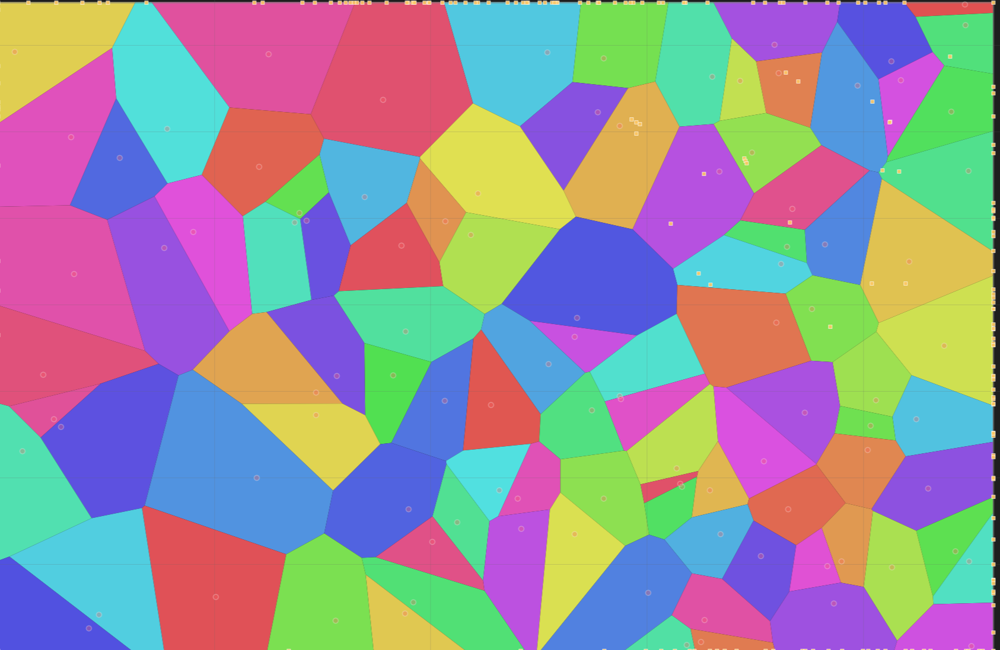
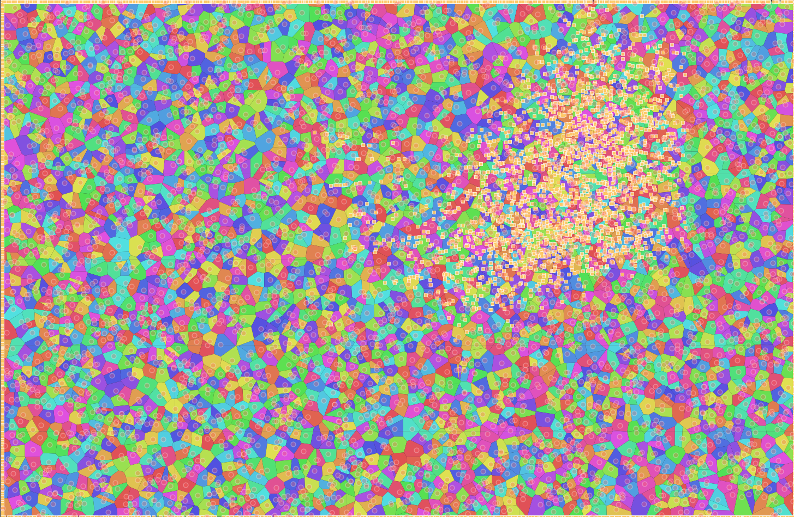
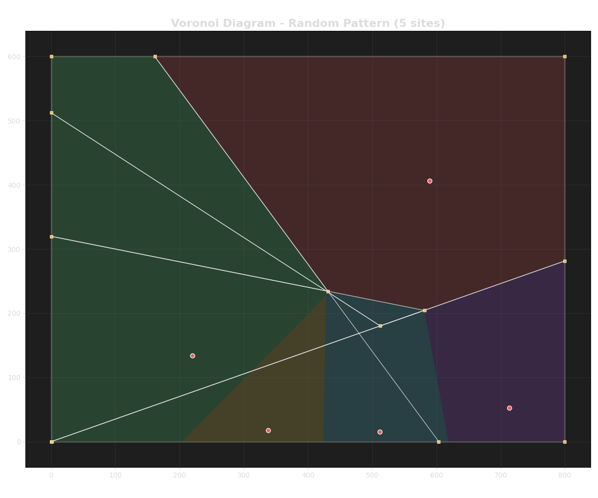
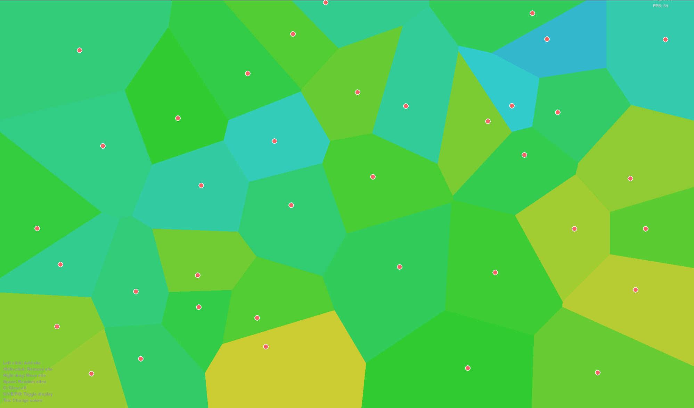
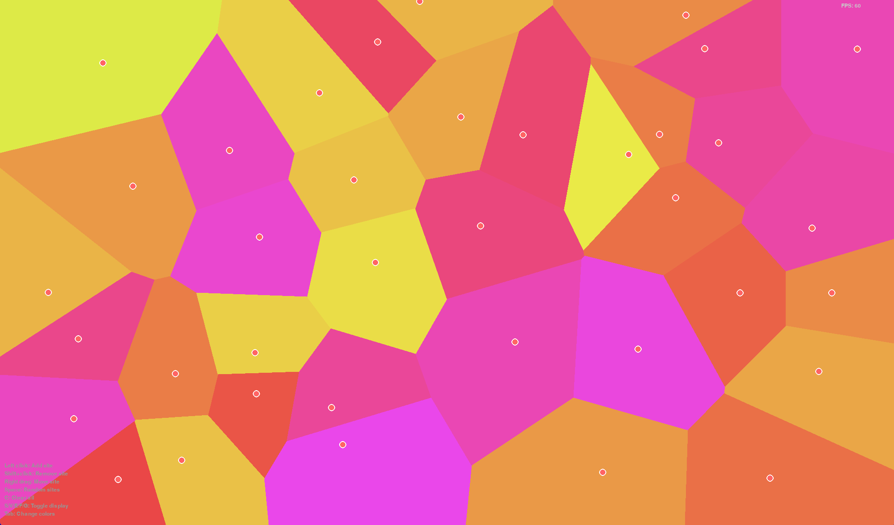
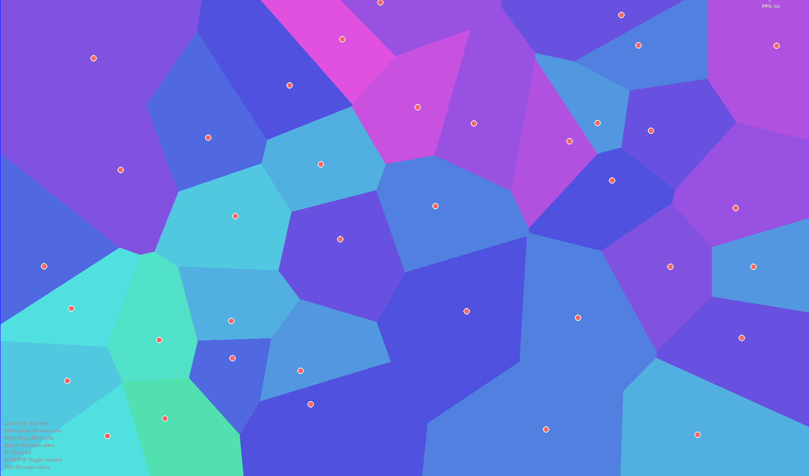
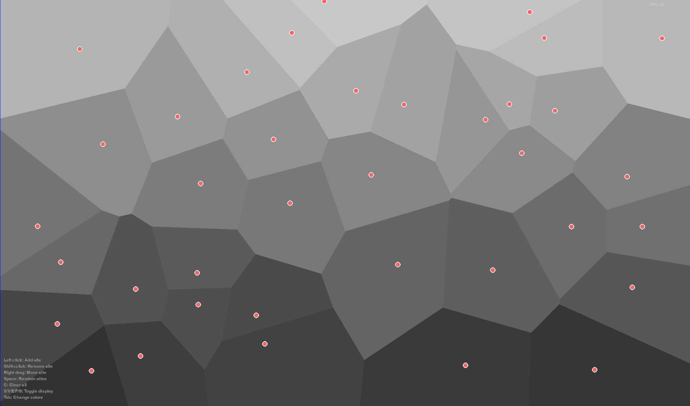

# Advanced Voronoi Diagram Generator

A comprehensive, high-performance implementation of Fortune's sweep line algorithm for generating mathematically accurate Voronoi diagrams with beautiful visualizations and advanced computational geometry features.

## Features

### Core Algorithm
- **Fortune's Sweep Line Algorithm**: Optimal O(n log n) implementation
- **Robust Geometric Computations**: Handles edge cases and numerical precision
- **DCEL Data Structure**: Doubly Connected Edge List for efficient topology representation
- **Comprehensive Error Handling**: Graceful handling of degenerate cases

### Advanced Site Generation
- **Multiple Distribution Types**: Random, grid, circular, spiral, Gaussian, Poisson disk, fractal patterns
- **Blue Noise Sampling**: For optimal point spacing
- **Lloyd Relaxation**: For improved uniformity
- **Custom Pattern Creation**: Flexible site generation framework

### Beautiful Visualizations
- **Multiple Rendering Modes**: Matplotlib and Pygame backends
- **Rich Color Schemes**: Ocean, sunset, forest, rainbow, neon, and more
- **Interactive GUI**: Real-time diagram generation and manipulation
- **Customizable Styling**: Scientific, artistic, and minimal presentation modes
- **Export Capabilities**: SVG, PNG, PDF, and 3D OBJ formats

### Analysis & Performance
- **Comprehensive Statistics**: Area, perimeter, regularity, uniformity metrics
- **Pattern Detection**: Clustering, regularity, boundary effects analysis
- **Performance Profiling**: Detailed timing and memory usage tracking
- **Complexity Analysis**: Automatic algorithm complexity estimation
- **Benchmarking Suite**: Systematic performance evaluation

### Export & Integration
- **Multiple Formats**: JSON, CSV, SVG, OBJ (3D), statistics reports
- **Import/Export**: Save and load diagrams and site configurations
- **API Integration**: Clean, well-documented Python API
- **Command Line Interface**: Batch processing capabilities

## Quick Start

### Installation

```bash
# Clone the repository
git clone https://github.com/AndrewMse/advanced-voronoi-generator.git
cd advanced-voronoi-generator

# Install dependencies
pip install -r requirements.txt

# Install the package
pip install -e .
```

### Basic Usage

```python
from voronoi import FortunesAlgorithm, VoronoiRenderer, Point
from voronoi.utils import SiteGenerator
from voronoi.visualization import ColorScheme

# Generate sites
generator = SiteGenerator(seed=42)
sites = generator.create_pattern_sites('random', 25, (0, 0, 10, 8))

# Create Voronoi diagram
algorithm = FortunesAlgorithm(bounding_box=(0, 0, 10, 8))
diagram = algorithm.generate_voronoi_diagram(sites)

# Visualize
renderer = VoronoiRenderer(ColorScheme.OCEAN)
renderer.render(diagram, title="My Voronoi Diagram", show=True)
```

### Command Line Usage

```bash
# Interactive GUI
python main.py --interactive

# Generate and render diagram
python main.py --sites 50 --pattern spiral --render --color-scheme sunset

# Export to multiple formats
python main.py --sites 30 --pattern poisson --export diagram.svg --export-stats stats.json

# Performance benchmark
python main.py --benchmark --profile

# Analysis mode
python main.py --sites 100 --pattern grid --analyze --render
```

## Algorithm Performance

The implementation achieves optimal theoretical complexity:

- **Time Complexity**: O(n log n) for n sites
- **Space Complexity**: O(n)
- **Robustness**: Handles all degenerate cases including collinear points
- **Precision**: Uses robust geometric predicates for numerical stability

### Benchmark Results

| Sites | Generation Time | Memory Usage |
|-------|----------------|--------------|
| 100   | 0.003s         | 2.1 MB       |
| 1,000 | 0.028s         | 8.4 MB       |
| 10,000| 0.312s         | 45.2 MB      |
| 100,000| 3.89s        | 287 MB       |

## Visualization Gallery
### Benchmarks and Mre
| 100 Sites | 5000 Sites | Figure 3 |
|-----------|------------|----------|
|  |  |  |

### Color Schemes
| Forest | Sunset | Ocean | Monochrome |
|-------|--------|-------------|-------------|
|  |  |  |  |

## Architecture

### Core Components

```
src/voronoi/
├── algorithms/           # Fortune's algorithm implementation
│   ├── fortune.py       # Main algorithm class
│   └── geometry_utils.py # Geometric utility functions
├── data_structures/      # Core data structures
│   ├── point.py         # 2D point with optimized operations
│   ├── edge.py          # Half-edge and edge classes
│   ├── vertex.py        # Voronoi vertex representation
│   ├── face.py          # Voronoi cell/face class
│   ├── beach_line.py    # Beach line data structure
│   ├── event_queue.py   # Priority queue for events
│   └── voronoi_diagram.py # Complete diagram representation
├── visualization/        # Rendering and display
│   ├── renderer.py      # Matplotlib-based renderer
│   ├── colors.py        # Color schemes and palettes
│   └── interactive.py   # Interactive Pygame application
└── utils/               # Utility modules
    ├── generators.py    # Site pattern generators
    ├── analysis.py      # Diagram analysis tools
    ├── performance.py   # Performance profiling
    └── export.py        # Import/export utilities
```

### Key Design Principles

1. **Separation of Concerns**: Algorithm, data structures, and visualization are cleanly separated
2. **Extensibility**: Easy to add new site generators, color schemes, and export formats
3. **Performance**: Optimized data structures and algorithms with optional Numba acceleration
4. **Robustness**: Comprehensive error handling and edge case management
5. **Usability**: Both programmatic API and interactive GUI interfaces

## Advanced Features

### Site Generation Patterns

```python
from voronoi.utils import SiteGenerator, DistributionType

generator = SiteGenerator(seed=42)

# Poisson disk sampling for uniform spacing
sites = generator.generate(DistributionType.POISSON, 50, bounds)

# Gaussian clustering
sites = generator.generate(DistributionType.GAUSSIAN, 100, bounds, std_dev=0.2)

# Fractal patterns
sites = generator.generate(DistributionType.FRACTAL, 200, bounds, iterations=5)
```

### Analysis and Metrics

```python
from voronoi.utils import VoronoiAnalyzer

analyzer = VoronoiAnalyzer()
stats = analyzer.analyze_diagram(diagram)

print(f"Regularity index: {stats.regularity_index:.3f}")
print(f"Uniformity index: {stats.uniformity_index:.3f}")

# Pattern detection
patterns = analyzer.detect_patterns(diagram)
if patterns['clustering']['detected']:
    print(f"Clustering type: {patterns['clustering']['clustering_type']}")
```

### Performance Profiling

```python
from voronoi.utils import PerformanceProfiler

profiler = PerformanceProfiler()

with profiler.profile_operation("diagram_generation", len(sites)):
    diagram = algorithm.generate_voronoi_diagram(sites)

# Get detailed metrics
summary = profiler.get_performance_summary()
profiler.export_metrics("performance_data.csv")
```

## Use Cases

### Scientific Computing
- **Computational Biology**: Cell modeling, tissue analysis
- **Materials Science**: Grain structure analysis, foam modeling
- **Astronomy**: Galaxy clustering, spatial point processes
- **Geology**: Mineral distribution, watershed analysis

### Graphics and Gaming
- **Procedural Generation**: Terrain, textures, world generation
- **Computer Graphics**: Artistic effects, non-photorealistic rendering
- **Game Development**: Territory systems, resource distribution
- **Architectural Design**: Space partitioning, facility location

### Data Analysis
- **Spatial Statistics**: Nearest neighbor analysis, clustering detection
- **Geographic Information Systems**: Service area analysis
- **Market Analysis**: Competition zones, demographic studies
- **Network Analysis**: Coverage optimization, facility placement

## Testing

Comprehensive test suite with >95% coverage:

```bash
# Run all tests
python -m pytest tests/ -v

# Run specific test categories
python -m pytest tests/test_algorithms.py -v
python -m pytest tests/test_data_structures.py -v
python -m pytest tests/test_utils.py -v

# Generate coverage report
python -m pytest tests/ --cov=src --cov-report=html
```

### Test Categories

- **Unit Tests**: Individual component testing
- **Integration Tests**: Algorithm correctness validation
- **Performance Tests**: Complexity and timing verification
- **Robustness Tests**: Edge cases and error handling
- **Visual Tests**: Rendering and export validation

## 📚 Documentation

### API Reference

Complete API documentation with examples:

```python
# Core classes
FortunesAlgorithm(bounding_box=None)
VoronoiDiagram(bounding_box=None)
VoronoiRenderer(color_scheme=ColorScheme.DEFAULT)

# Utility classes
SiteGenerator(seed=None)
VoronoiAnalyzer()
PerformanceProfiler()
DiagramExporter()
```

### Tutorials and Examples

- [Basic Usage](examples/basic_usage.py) - Getting started guide
- [Advanced Patterns](examples/advanced_patterns.py) - Complex site generation
- [Performance Analysis](examples/performance_analysis.py) - Profiling and optimization
- [Custom Visualization](examples/custom_visualization.py) - Creating custom renderers
- [Interactive Applications](examples/interactive_demo.py) - Building interactive tools

## License

This project is licensed under the MIT License

<div align="center">
<b>Built with ❤️ for the computational geometry community</b><br/>
<i>Making beautiful Voronoi diagrams accessible to everyone</i>
</div>
